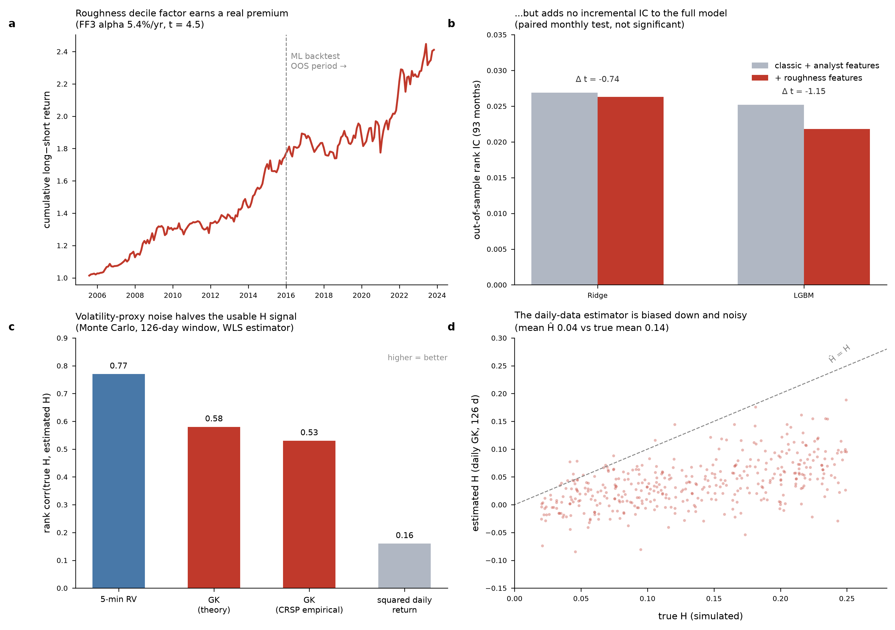

# Does Volatility Roughness Price the Cross-Section? A Replication and Post-Mortem

Cross-sectional US equity study (CRSP/Compustat/IBES via WRDS, 2005–2023,
~3,200 liquid names per month) testing whether a rough-volatility Hurst
signal — per Glasserman & He (2020), "Buy Rough, Sell Smooth" — adds
information to a classic-factor + analyst-revision baseline.

**Answer: the standalone factor is real, but it adds nothing to the baseline
model, and on daily data roughly half of any true roughness signal is
destroyed by volatility-proxy measurement noise before the model ever sees
it.** Each claim is tested below.



## Findings

**1. The standalone roughness factor earns a genuine premium.**
Decile long-short ("buy rough, sell smooth") on `roughness_gk_126d`:
5.1%/yr gross, FF3 alpha 5.4%/yr (HAC t = 4.5), rank IC 0.013 (t = 5.3),
n = 218 months, near-zero FF3 loadings (R² = 0.02). It is not a
volatility or liquidity tilt in disguise: the Fama-MacBeth premium survives
rv/beta/idio-vol/Amihud/turnover controls at 7.7 bp/mo (t = 3.4), and it
survives realistic costs (4.0%/yr net at 10 bps round-trip, 44%/mo one-sided
turnover). It also does not die out of sample: 2016–2023 alpha 4.9%/yr
(t = 2.4) vs 2005–2015 5.5%/yr (t = 3.7).

**2. But it adds zero incremental information to the ML model.**
Paired monthly IC test, full feature set vs the same pipeline with roughness
features removed (identical walk-forward windows, 93 OOS months):
ΔIC = −0.0006 (t = −0.74) for ridge, −0.0033 (t = −1.15) for LGBM.
The baseline (classic price/fundamental factors + IBES analyst features)
already spans what the roughness factor captures at portfolio level — a
5%/yr univariate premium with IC 0.013 is simply too weak to move a model
whose own IC is 0.026–0.034.

**3. Mechanism: daily volatility proxies destroy the signal before estimation.**
Monte Carlo (`src/hurst_noise_simulation.py`): simulate stocks with known
heterogeneous H, observe log-vol through proxies of increasing measurement
noise, re-estimate H with this project's WLS estimator (126d window, lags
1–10). Rank correlation between true and estimated H:

| volatility proxy | noise var (log-vol) | signal retained |
|---|---|---|
| 5-min realized variance | 0.006 | 77% |
| Garman-Klass daily (theory) | 0.167 | 58% |
| Garman-Klass on CRSP askhi/bidlo | 0.215 | 53% |
| squared daily return | 1.234 | 16% |

Two corollaries. (i) BRSS's use of high-frequency realized variance is not
incidental — the effect is not recoverable at full strength from daily data.
(ii) The fitted Ĥ ≈ 0.04–0.06 we (and others) obtain on daily data is biased
far below true H by the noise nugget (simulated mean Ĥ 0.03 vs true 0.14);
with only 10 lags, nugget and H are barely separately identifiable, so small
fitted Ĥ on daily data is a noise signature, not independent evidence that
volatility is rough.

## What I would do differently

Estimate H from intraday realized variance (TAQ / 1-minute bars), which the
simulation says preserves ~77% of the cross-sectional signal instead of ~53%.
That requires order-book-scale infrastructure — see the companion
high-frequency project.

## Pipeline

Point-in-time discipline: fundamentals lagged to the `rdq` announcement date,
analyst data to `STATPERS`, delisting returns included (survivorship-bias-free
CRSP universe: price ≥ $5, ADV ≥ $1M, ≥ 252d listed, ~3,200 names/month).
8-window walk-forward (train/val/test), 20-day embargo, monthly rebalance,
20-day forward cross-sectionally demeaned labels. Models: ridge, LGBM,
LGBMRanker, ensemble. Costs charged at 0/5/10/20 bps on turnover.

Baseline OOS results (93 months, 2016–2023): ensemble rank IC 0.035
(HAC t = 4.5), long-short Sharpe 1.0 gross → 0.84 at 10 bps; FF3 alpha
20%/yr (t = 3.4). LGBM long-short Sharpe 1.23 gross → 1.0 at 10 bps.

```
src/
  universe.py, labels.py            # PIT universe & forward labels
  features_{price,risk,fundamental,analyst}.py
  features_rough_vol{,_v2}.py       # Whittle / Volterra / GK-BRSS Hurst
  train.py, models.py               # walk-forward training
  backtest.py, monthly_backtest.py, daily_backtest.py
  evaluation.py, factor_attribution.py
  roughness_ablation_tests.py       # paired IC, Fama-MacBeth, FF3 spanning  ← start here
  hurst_noise_simulation.py         # measurement-noise Monte Carlo          ← and here
```

Reproduce the headline tests:

```bash
python src/roughness_ablation_tests.py   # → data/reports/roughness_ablation_summary.csv
python src/hurst_noise_simulation.py     # → data/reports/hurst_noise_attenuation.csv
```

Raw WRDS extracts land in `data/raw/` (see `方案.txt` for the exact
tables/fields). Requires: pandas, pyarrow, scipy, scikit-learn, lightgbm.

## References

- Glasserman & He (2020), *Buy Rough, Sell Smooth*, Quantitative Finance.
- Gatheral, Jaisson & Rosenbaum (2018), *Volatility is Rough*, Quantitative Finance.
- Fukasawa, Takabatake & Westphal (2022), *Is Volatility Rough?* — on H
  inference under proxy noise.
- Bailey & López de Prado (2014), *The Deflated Sharpe Ratio*.
